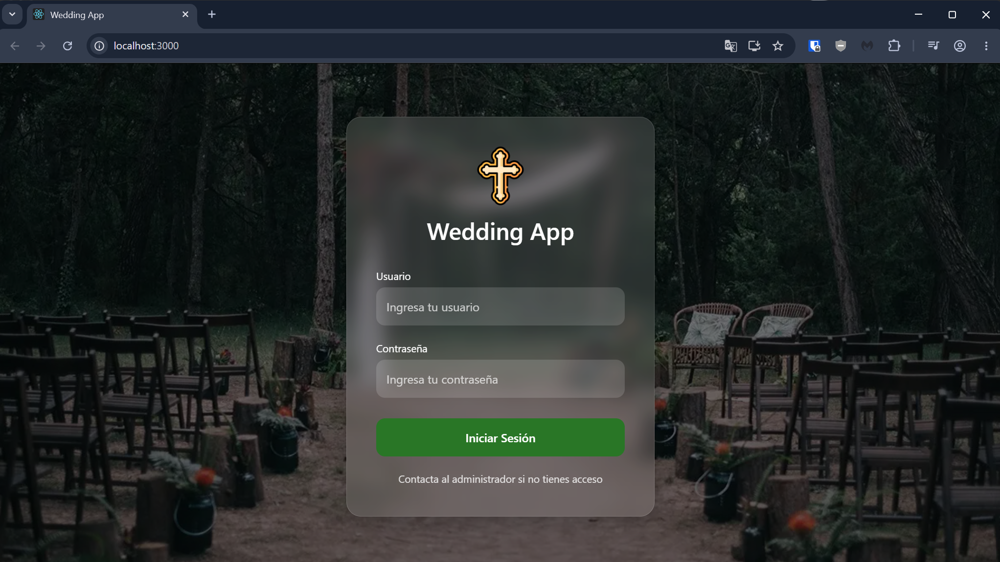
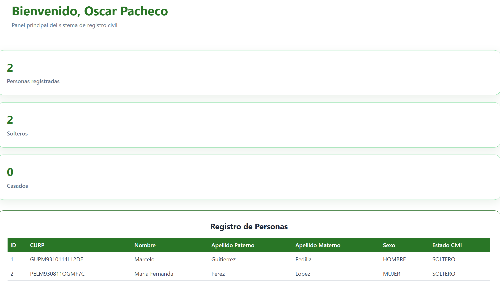
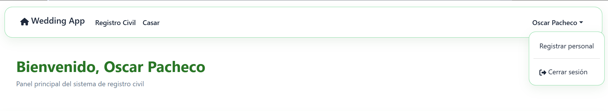
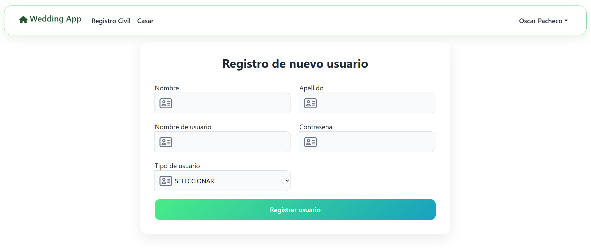
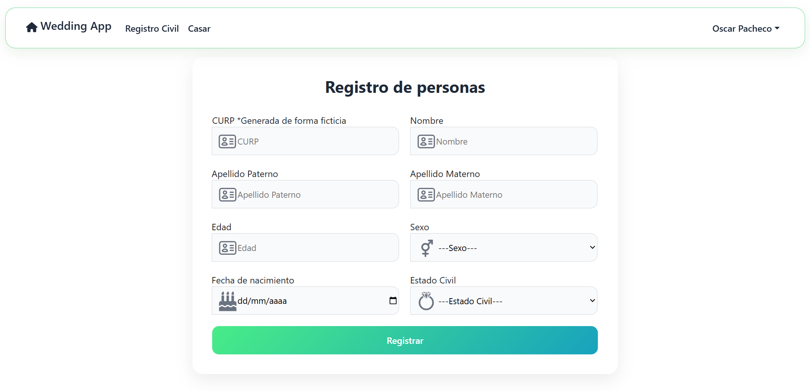
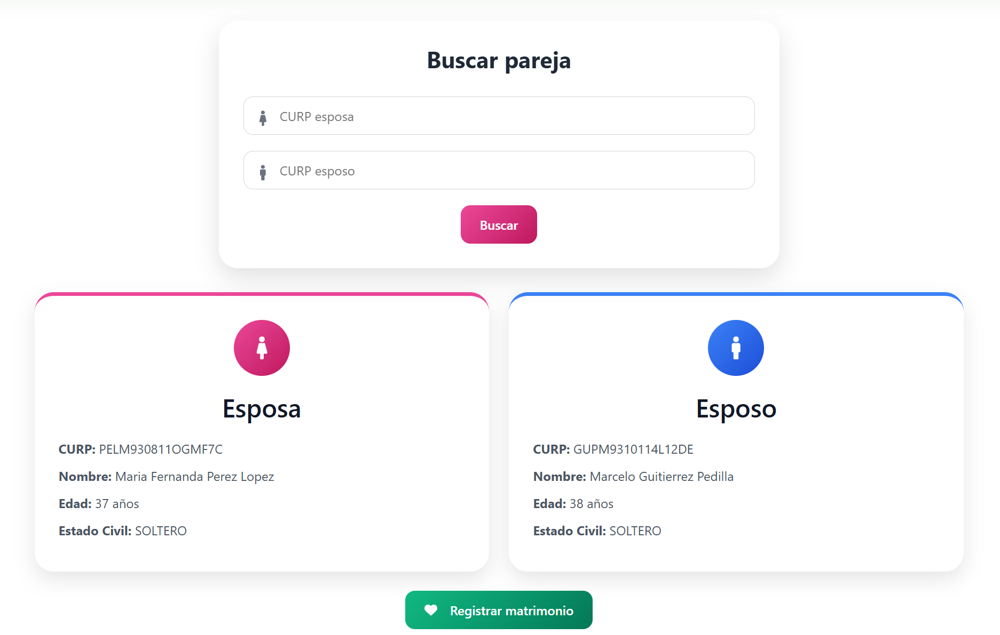

# Wedding-App 💍
Sistema de Gestión Matrimonial

Este repositorio contiene los archivos para el funcionamiento del sistema de Wedding-App, el cual, se divide en 2 carpetas, `/api` y `/client`, dentro de estas se encuentra la lógica para hacer funcional los siguientes requerimientos. 

- Inicio de sesión.
- Registro de personas.
- Listado de personas registradas.
- Emparejamiento (casamiento).

**Limitaciones:**
- No soporta divorcios: La idea del sistema corresponde a un tanto religiosa, por lo que, el divorcio no esta permitido por el momento.
- Interfaz de Administrador incompleta: Hay algunos puntos en los cuales se sigue trabajando para integrarlos en el futuro.

## 📁 Estructura del proyecto

wedding-app/
├── api/
│   ├── src/
│   │   ├── controllers/
│   │   ├── middlewares/
│   │   ├── routes/
│   │   └── db.js
│   ├── index.js
│   └── .env
│
├── client/
│   ├── public/
│   ├── src/
│   │   ├── Components/
│   │   ├── Helpers/
│   │   ├── Pages/
│   └── └── Css/
│
└── bodas.sql

## 🛠️ Tecnologías utilizadas

### 🖥️ Frontend
- React
- Axios
- React Router DOM
- Bootstrap
- React Icons

### 🖥️ Backend
- Node.js
- Express.js
- bcryptjs
- JSON Web Tokens (JWT)

### 💾 Base de datos
- MySQL

## 🔐 Seguridad

- Contraseñas cifradas con bcrypt.
- Autenticación basada en JWT.
- Rutas protegidas por roles (ADMIN y USER).
- Validación de token y expiración automática.

## ⚙️ Instalación
Antes de comenzar asegúrate de estar en una carpeta donde vayas a guardar el proyecto, puede ser, por ejemplo `/Proyectos` o `/Trabajos`. Después puedes comenzar con el proceso.

### ⬇️ Descarga del repositorio
1. Dentro de la carpeta donde vas a guardar el repositorio haz clic derecho -> "Abrir en Terminal".
2. Escribe y ejecuta el siguiente comando 
```bash
git clone https://github.com/OscarPachecoH/wedding-app.git
```
y presiona "Enter".
3. Entra a tu editor de texto preferido y verifica que los archivos se hayan descargado completos en tu carpeta.

### 🖥️ API
1. Navega a la carpeta `/api`.
2. Crea el archivo .env con la siguiente estructura:
```bash
PORT=TU PUERTO
DB_HOST=TU HOST
DB_PORT=TU PUERTO DE BASE DE DATOS
DB_USER=TU USUARIO DE BD
DB_PASSWORD=CONTRASEÑA DE TU USUARIO
DB_DATABASE=bodas
JWT_SECRET=TU PALABRA SECRETA
```
3. Después, en la terminal buscar la ruta donde tengas guardada la api y ejecuta el comando `npm install` para instalar las dependencias.
4. Por último, para inicializar el servidor usa el comando `npm start`.

### 🖥️ Cliente
1. Navega a la carpeta `/client`.
2. Ejecuta `npm install` para instalar las dependencias.
3. Inicia la aplicación con `npm run dev`.
4. Se mostrara el inicio de sesión en el navegador.

### 💾 Base de datos
1. Busca el archivo `bodas.sql` y ábrelo, en este están las instrucciones para crear la base de datos. Observa que ya hay un usuario llamado "Admin Prueba", puedes dejarlo o ignorarlo. *Ojo: Si decides insertar el usuario "Admin Prueba" no borres ningún carácter del apartado de contraseña ya que pueden ocurrir errores al momento de iniciar sesión.*
2. Importa el archivo `bodas.sql` en un gestor de base de datos SQL (como MySQL o PostgreSQL).
3. Verifica que todo esté en orden y funcionando haciendo consultas básicas.

## 🔓 Configuraciones para iniciar sesión
### 🤖 Con usuario predeterminado
Si decidiste usar el usuario que ya viene insertado en la base de datos sigue estos pasos:
1. Una vez que la API y el cliente estén ejecutándose, la aplicación deberá mostrar la pantalla principal de inicio de sesión. Usa las credenciales `user: @admin1`, `password: demo1234`.

*Pagina de inicio de sesión con diseño profesional*

### 🤖 Si no usaste el usuario predeterminado
Si por el contrario decidiste no usar el usuario predeterminado tendrás que hacer lo siguiente:
1. Ve a `/api/src/routes/login.routes.js` y tendrás que cambiar la siguiente línea:
```bash
router.post('/registrar', verifyToken, verifyAdmin, registrer);
```
por la siguiente:
```bash
router.post('/registrar', registrer);
```
Ya que para realizar registros de personal se necesita un token de sesión (verifyToken) y que el usuario logueado sea de tipo "Admin" (verifyAdmin).
2. Usa algun cliente como Postman o ThunderClient si usas VS Code para poder registrar el usuario y usa el siguiente json para registrarlo:
```bash
{
   "name": "tu nombre",
   "lastName": "tu apellido",
   "username": "@admin1",
   "password": "demo1234",
   "role": "ADMIN"
}
```
3. Verifica que en base de datos este insertado el usuario, en el apartado de contraseña veras que también hay varios caracteres, esto es porque la contraseña esta hasteada. Ten cuidado de no cambiar nada ya que esto podría hacer que pierdas acceso al sistema con este usuario.
4. Ahora si podrás iniciar sesión.

## 🚀 Uso del sistema
1. Una vez iniciada la sesión podrás entraras al Dashboard del admin. Podrás ver la navbar con las opciones disponibles, unas pequeñas tarjetas con algunos datos y una tabla que contendrá los datos registrados en la tabla "personas".

*Dashboard con diseño minimalista y profesional*
2. En la parte superior derecha del navbar podrás ver el nombre del usuario logueado, en este caso, "Admin Prueba" y podrás desplegar un menú haciendo clic en este y te mostrara las opciones de "Registrar personal" y "Cerrar sesión".

3. Dentro de la opción de "Registrar personal" podrá iniciar el registro de un nuevo usuario para el sistema y podrá seleccionar si será "Admin" o "User".


Las siguientes opciones pueden ser realizadas por los dos tipos de usuarios "Admin" o "User"

4. **Registrar:**
   - Selecciona esta opción "Registro Civil" para mostrar un formulario donde puedes ingresar los datos de una persona.
   - Podrás llenar todos los espacios excepto la CURP, este se genera de forma automática usando los datos ingresados en los demás campos. *Ojo: Esto es solo para pruebas, los datos son ficticios.*
   
5. **Casar:**
   - Muestra un formulario con dos campos para ingresar las CURPs de las personas a emparejar.
   - Primero se realiza una búsqueda de ambas y se validan los datos para comprobar que estos no tengan ya un "compromiso" o no cumplan la mayoría de edad.
   

## 🏁 Mejoras futuras

- Restablecimiento de contraseña.
- Administración y consulta de matrimonios.
- Exportación a PDF (Certificado de matrimonio.).
- Panel de estadísticas.

## 📬 Contacto
Si te interesa mi trabajo o quieres colaborar en algún proyecto o tienes dudas del proyecto contáctame:
Email: josuehernaa@gmail.com
LinkedIn: https://www.linkedin.com/in/oscar-pacheco-3a1325245/
GitHub: https://github.com/OscarPachecoH

## 📜 Licencia
Este proyecto está bajo la Licencia MIT (LICENSE). Siéntete libre de usarlo como inspiración, pero por favor da crédito si reutilizas partes de mi trabajo.